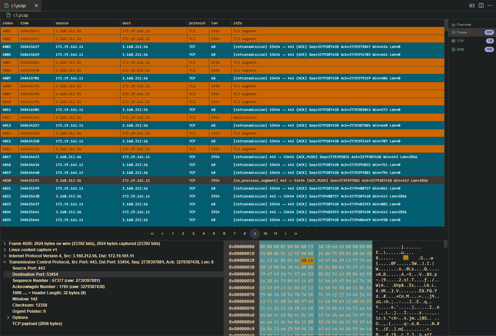
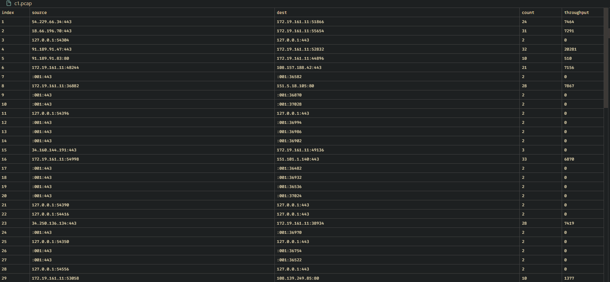
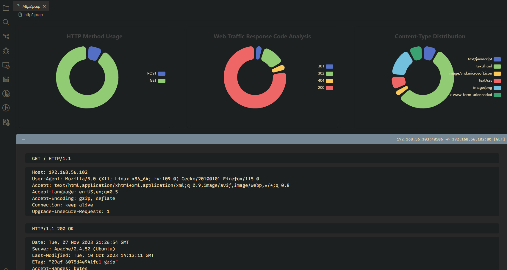
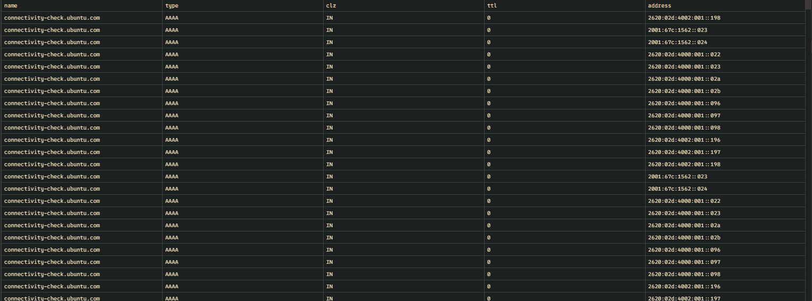

  

  
  
  
  
  
  
  
  

---

## Overview

**PcapViewer** is an open-source packet analysis tool designed to efficiently handle PCAP/PCAPNG (Packet Capture) files. It enables users to dive into network traffic and inspect various protocol layers, from the physical Ethernet layer to the application layer, providing a streamlined alternative to full-scale tools like Wireshark. With its lightweight nature, it’s ideal for developers, network administrators, and engineers who need quick insights into network packets.

---

### Key Features

- **Protocol Support**:
  - **File Formats**: PCAP, PCAPNG
  - **Link Layer**: Ethernet II, PPPoE, IEEE 1905.1a, SSL
  - **Network Layer**: IPv4, IPv6, ARP, RARP, ICMP, IGMP
  - **Transport Layer**: TCP, UDP
  - **Application Layer**: TLS, HTTP, DNS, DHCP, SSDP

---

### Online Demo

Try out [PcapViewer](https://sankooc.github.io/pcap/) in your browser.

---

### Features in Action

#### Demo

  

  
IP Packet Overview

  

---

  
IP Packet List

  

---

  
TCP Conversations

  

---

  
HTTP Connection

  

---

  
DNS Response

  

---

### VS Code Extension

Install the **PcapViewer** extension from the [VSCode Marketplace](https://marketplace.visualstudio.com/items?itemName=sankooc.pcapviewer) for seamless integration into your Visual Studio Code environment.

---

### ZED Extension

> Coming soon...

---

### Contribution

We welcome contributions! If you'd like to contribute, please check out the guidelines (coming soon) and open a pull request or issue.

---

### Contact

For any inquiries or suggestions, feel free to reach out to us (details coming soon).

---

