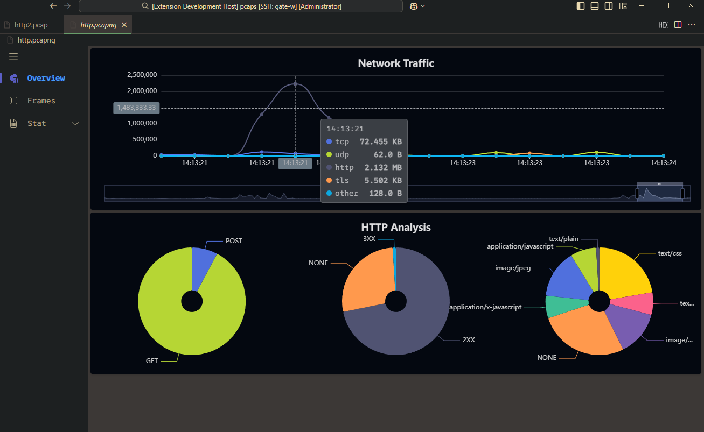

<p align="center">
  
</p>
<h1 align="center">Pcapviewer</h1>

<p align="center">
  <a href="/">
    
  </a>
  <a href="https://marketplace.visualstudio.com/items?itemName=sankooc.pcapviewer">
    
  </a>
  <a href="https://marketplace.visualstudio.com/items?itemName=sankooc.pcapviewer">
    
  </a>
  <a href="https://marketplace.visualstudio.com/items?itemName=sankooc.pcapviewer">
    
  </a>
  <a href="/">
    
  </a>
  <a href="/">
    
  </a>
  <a href="/">
    
  </a>
  <a>
    
  </a>
</p>

## Overview

**PcapViewer** is a powerful, multi-platform tool that simplifies network traffic analysis, bringing essential PCAP/PCAPNG file inspection capabilities directly into your preferred environment: **Visual Studio Code, Terminal UI,  a standalone Desktop Application, or a dedicated Web Service.**

It enables users to dive into network traffic and inspect various protocol layers, from the Ethernet layer to the application layer, providing a streamlined alternative to full-scale tools like Wireshark. With its lightweight nature, it’s ideal for developers, network administrators, and engineers who need quick insights into network packets.


### 🌟 Features

- **Native Integration:** Seamless operation as a custom editor within VS Code.
- **Multi-format Support:** Handles `.pcap`, `.pcapng`, and `.cap` files.
- **High Performance:** Utilizes WASM and Rust for fast and efficient packet analysis.
- **Extensible Design:** Open to contributions and improvements via the modular architecture.

### 🔌 Protocol Support

  - **File Formats**: PCAP, PCAPNG
  - **Link Layer**: Ethernet II, PPPoE, IEEE 1905.1a, IEEE 802.11, SSL
  - **Network Layer**: IPv4, IPv6, ARP, RARP, ICMP, IGMP
  - **Transport Layer**: TCP, UDP
  - **Application Layer**: TLS, HTTP, DNS, DHCP, SSDP, SIP

### 📦 Online Demo

Try out [PcapViewer](https://sankooc.github.io/vs-shark/app/) in your browser.


### 🚀 Features in Action

#### Demo

  


<details>
  <summary>Overview</summary>
  
</details>


<details>
  <summary>IP Packet List</summary>
  
</details>


<details>
  <summary>TCP Conversations</summary>
  
</details>


<details>
  <summary>HTTP Connection</summary>
  
  
</details>


<details>
  <summary>UDP Statistics</summary>
  
</details>


<details>
  <summary>TLS Host</summary>
  
</details>


### 💻 Installation & Usage

#### 1\. VS Code Extension

Install the **PcapViewer** extension from the [VSCode Marketplace](https://marketplace.visualstudio.com/items?itemName=sankooc.pcapviewer) for seamless integration into your Visual Studio Code environment.


#### 2\. TUI 


* **Installation:** Download from [Releases](https://github.com/sankooc/vs-shark/releases)

* **Execution:** Run the executable with the `--file` argument pointing to your file:
`pcaps -f <filepath>`


#### 3\. Desktop Application (Standalone GUI)

For users who prefer a dedicated, cross-platform graphical application.

  * **Installation:** Download the installer/binary for your operating system (Windows, macOS, Linux) from the [Releases page](https://github.com/sankooc/vs-shark/releases).
  * **Usage:** Launch the application and use the file dialog to open your PCAP file for analysis.

#### 4\. Web Service (Browser Access)

Launch a local web server to analyze a specific PCAP file and access the UI through your web browser. This is ideal for remote access or containerized environments.

1.  **Execution:** Run the executable with the `--file` argument pointing to your file:
    ```bash
    pcap-web -f /path/to/your/traffic.pcap -p 8080
    ```
    (Note: Command name may vary based on your build. Check the executable output for the exact command.)
2.  **Access:** Open your web browser and navigate to the address displayed in the console (typically `http://127.0.0.1:8080` or similar).


### 🤝 Contributing

We welcome all community involvement and appreciate your interest in making **`PcapViewer`** better\!

Please take a moment to review our official guidelines before contributing:

  * **Contribution Guidelines:** For details on submitting Pull Requests, reporting bugs, and suggesting new features, please see the **[`CONTRIBUTING.md`](./CONTRIBUTING.md)** file.
  * **Code of Conduct:** To ensure a welcoming and inclusive community for everyone, all participants are expected to adhere to our **[`CODE_OF_CONDUCT.md`](./CODE_OF_CONDUCT.md)**.


### 📜 License

This project is licensed under the [MIT License](./LICENSE).


